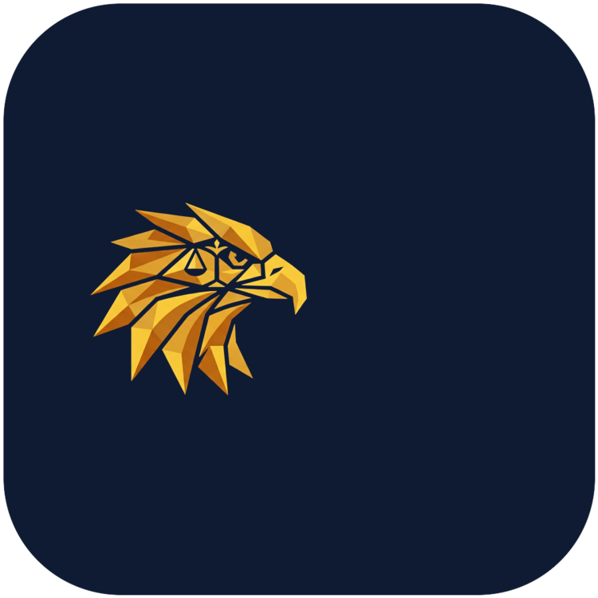
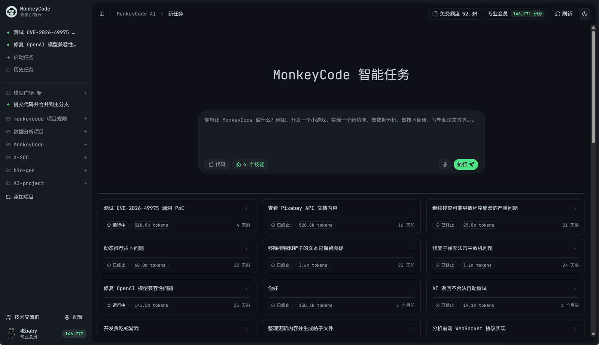
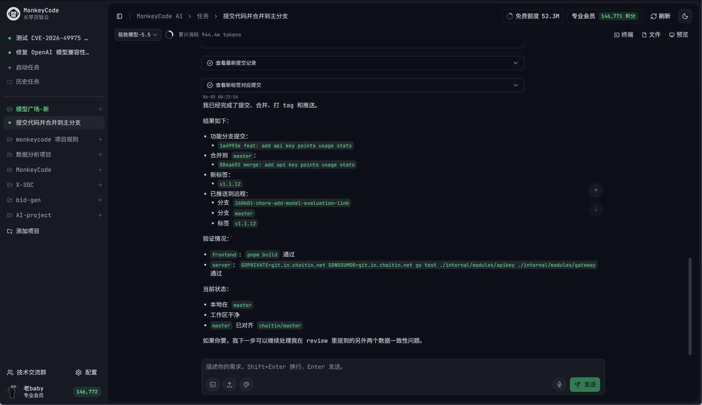
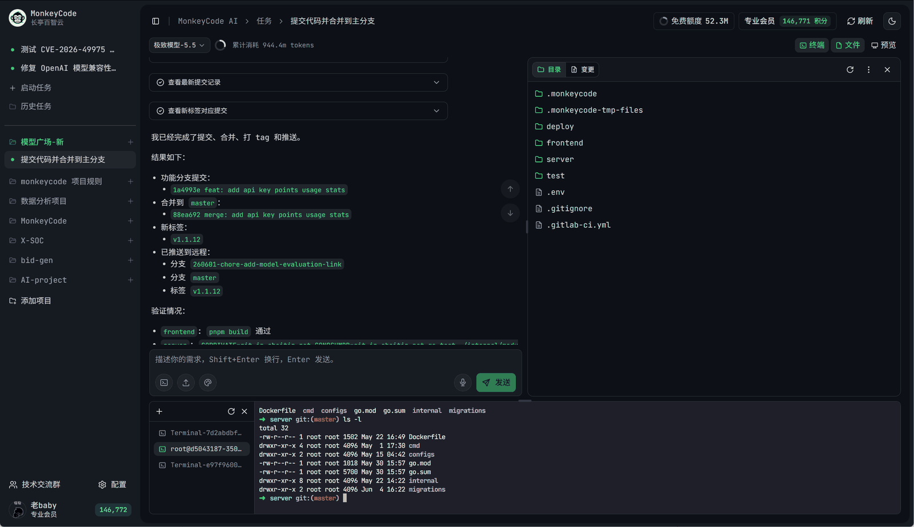
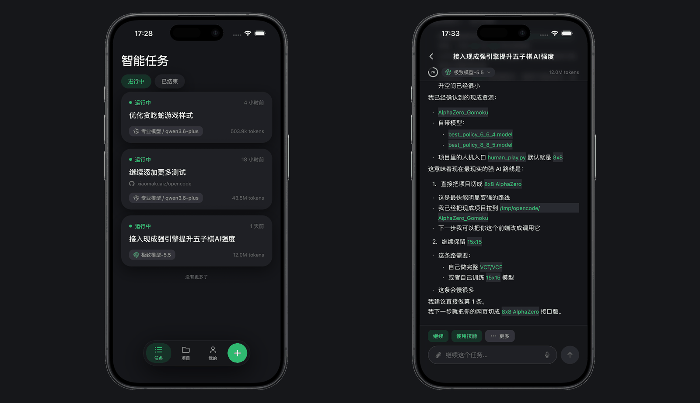

# NemesisCode

<p align="center">
  
</p>

<p align="center">
  <em>L'aigle de la justice — votre assistant de développement IA, sur votre machine.</em>
</p>

<p align="center">
  <a href="./LICENSE"></a>
  <a href="./docs/README.md"></a>
  <a href="./readme.cn.md">中文</a>
</p>

---

## Qu'est-ce que NemesisCode ?

**NemesisCode** est une plateforme de développement pilotée par l'IA, pensée
pour un usage **personnel et en petite équipe**. Issue d'un fork de
MonkeyCode, elle réunit dans une même interface :

- la **création et le suivi de tâches IA** (développement, revue, débogage) ;
- la **gestion de projets** et d'exigences (SPEC) ;
- la **configuration de fournisseurs d'API** (OpenAI, NVIDIA NIM, Fireworks AI,
  Cohere, DeepSeek, Ollama…) et la **sélection du modèle** par tâche ;
- un **terminal, un explorateur de fichiers, les diffs Git, les skills et les
  serveurs MCP** directement dans le navigateur ;
- un **mode local** : la machine qui exécute le backend devient
  l'environnement de développement de l'agent — aucune infrastructure cloud
  requise.

## Pourquoi NemesisCode ?

- 🖥️ **Mode local** : lancez le backend sur votre machine (ou un petit serveur),
  ouvrez le navigateur : l'agent travaille directement sur cette machine, dans
  des espaces de travail dédiés (`~/.nemesiscode/workspaces/`).
- 🔌 **Vos propres modèles** : configurez n'importe quel fournisseur compatible
  OpenAI (ou Anthropic), y compris les endpoints privés, NVIDIA NIM,
  Fireworks, Cohere… et les providers « Custom ».
- 🔓 **Open source** : code complet et auditable sous licence AGPL-3.0.
- 👥 **Collaboration** : projets, membres, rôles, review de PR/MR — pour une
  petite équipe sans dépendre d'un service tiers.

## Captures d'écran

<table>
  <tr>
    <td align="center">
      
      <br />
      <sub>Espace de travail de tâche IA</sub>
    </td>
    <td align="center">
      
      <br />
      <sub>Terminal et exécution de tâches</sub>
    </td>
  </tr>
  <tr>
    <td align="center">
      
      <br />
      <sub>Collaboration projet et fichiers</sub>
    </td>
    <td align="center">
      
      <br />
      <sub>Mobile : tâches et fichiers</sub>
    </td>
  </tr>
</table>

## Fonctionnalités

- **Tâches IA de bout en bout** : décrivez un besoin, l'agent le développe et
  le valide (build, test, preview) dans l'environnement choisi.
- **Environnements de développement** :
  - *mode cloud* : environnements serveur gérés (architecture historique) ;
  - *mode local* : la machine hôte du backend est l'environnement de l'agent.
- **Modèles multi-fournisseurs** : OpenAI, NVIDIA NIM, Fireworks AI, Cohere,
  DeepSeek, Moonshot/Kimi, SiliconFlow, Gemini, Hunyuan, Bailian, Volcengine,
  Azure OpenAI, Ollama (local) et **Custom (format OpenAI)** — sélection par
  tâche ou par défaut, liste des modèles récupérée depuis l'endpoint.
- **Skills & MCP** : jeux de compétences et serveurs MCP configurables.
- **Terminal web** : terminal interactif dans le navigateur, branché sur
  l'environnement de la tâche (la machine hôte en mode local).
- **Fichiers & diffs** : explorateur de fichiers, éditeur, diff Git par tâche.
- **Projets & collaboration** : gestion de projets, membres, rôles, review
  de PR/MR, tableaux de tâches.
- **Mobile** : applications iOS/Android natives (Expo) synchronisées.

## Démarrage rapide

### Option A — paquet Debian tout-en-un (recommandé)

Le paquet stable est référencé par **GitHub Releases** et conservé dans le
dossier versionné `releases/v1.2.1/` :

```bash
curl -fLO https://github.com/nemesisastarte-gif/nemesis-agent/raw/v1.2.1/releases/v1.2.1/nemesiscode_1.2.1_amd64.deb
curl -fLO https://github.com/nemesisastarte-gif/nemesis-agent/raw/v1.2.1/releases/v1.2.1/SHA256SUMS
sha256sum -c SHA256SUMS
sudo dpkg -i nemesiscode_1.2.1_amd64.deb
nemesiscode on       # → http://localhost:5000 (Admin / Admin)
```

Le backend statique, le frontend et le moteur opencode baseline sont inclus.
Voir [docs/deb-package.md](./docs/deb-package.md).

### Option B — Mode local depuis les sources

Prérequis : Go 1.25+, Node 22+, pnpm. **Aucun service externe requis** : base
SQLite + Redis en mémoire intégrés.

```bash
# Tout-en-un : compile le backend, démarre le backend (:8888) et le
# frontend (:5173) avec SQLite + Redis en mémoire + compte admin local.
scripts/nemesis-local.sh start
```

Ouvrez <http://localhost:5173> et connectez-vous avec
`Admin` / `Admin` (modifiable via
`MCAI_INIT_TEAM_EMAIL` / `MCAI_INIT_TEAM_PASSWORD`). Arrêt :
`scripts/nemesis-local.sh stop`. Installation détaillée (Termux/Linux) :
[docs/local-setup.md](./docs/local-setup.md).

**Sans le script** :

```bash
# Backend — mode local
cd backend
export MCAI_TASKFLOW_MODE=local
export MCAI_DATABASE_DRIVER=sqlite      # ou postgres + MCAI_DATABASE_MASTER
export MCAI_REDIS_HOST=                 # vide → Redis en mémoire intégré
export MCAI_INIT_TEAM_EMAIL=Admin
export MCAI_INIT_TEAM_PASSWORD=Admin
export MCAI_INIT_TEAM_IMAGE=local-env
export MCAI_SECURITY_CAPTCHA_ENABLED=false
go run ./cmd/server                     # écoute sur :8888

# Frontend — serveur de développement
cd ../frontend
pnpm install
TARGET=http://127.0.0.1:8888 pnpm run dev:offline   # proxy /api vers le backend
```

Puis :

1. **Settings → AI models** → choisissez un **provider** (NVIDIA NIM,
   Fireworks, Cohere, Custom…) → renseignez l'API token → la liste des modèles
   du fournisseur est chargée automatiquement.
2. Créez un **projet** (ou liez un dépôt Git), lancez une **tâche** : l'agent
   s'exécute sur la machine hôte, dans `~/.nemesiscode/workspaces/<tâche>`.
3. Utilisez le **terminal**, les **fichiers**, les **diffs** et les **skills**
   dans l'interface web.

Variables utiles du mode local (préfixe `MCAI_`) :

| Variable | Défaut | Rôle |
|---|---|---|
| `MCAI_TASKFLOW_MODE` | `remote` | `local` pour utiliser la machine hôte comme environnement |
| `MCAI_TASKFLOW_LOCAL_WORKSPACE_ROOT` | `~/.nemesiscode/workspaces` | racine des espaces de travail |
| `MCAI_TASKFLOW_LOCAL_AGENT_BIN` | `opencode` | binaire du moteur agent |
| `MCAI_TASKFLOW_LOCAL_SHELL` | `$SHELL` | shell des terminaux web |
| `MCAI_TASKFLOW_LOCAL_HOST_ID` | `local-<hostname>` | identifiant de l'hôte local |

> Le paquet `.deb` embarque opencode baseline. Pour un lancement depuis les
> sources, installez `opencode` dans le `PATH` ou définissez
> `MCAI_TASKFLOW_LOCAL_AGENT_BIN`. Design détaillé :
> [docs/local-mode-design.md](./docs/local-mode-design.md).

### Option C — Déploiement complet (docker-compose)

L'architecture historique complète (backend, base de données, redis,
clickhouse, rustfs, ingress, frontend) peut être déployée avec le
docker-compose de `backend/`. Le compose attend un jeu de variables
d'environnement (images, mots de passe, `INSTALL_DIR`…) : voir le modèle
d'installation dans `backend/templates/install.sh.tmpl`, ou lancez
manuellement les services `db` et `redis` uniquement pour le mode local.

## Configuration des fournisseurs d'API

L'interface **Settings → AI models** (et **Manager → AI models** pour
l'administrateur) permet de :

- choisir un **provider préconfiguré** : OpenAI, NVIDIA NIM, Fireworks AI,
  Cohere, DeepSeek, Moonshot (Kimi), SiliconFlow, Gemini, Hunyuan, Bailian,
  Volcengine, Azure OpenAI, Ollama… ;
- utiliser un **provider Custom (format OpenAI)** : n'importe quel endpoint
  compatible ;
- récupérer automatiquement la **liste des modèles** de l'endpoint
  (`GET {base}/models`) ou la saisir manuellement ;
- vérifier la configuration (health-check) avant l'enregistrement ;
- sélectionner le modèle par tâche via le sélecteur de l'interface.

## Structure du dépôt

| Dossier | Stack | Rôle |
|---|---|---|
| `backend/` | Go (Echo, ent, Redis, Postgres) | API serveur, tâches, modèles, mode local |
| `frontend/` | React 19 + Vite + Tailwind | Interface web |
| `desktop/` | Tauri (Rust) + React | Client desktop |
| `mobile/` | React Native / Expo | Applications mobiles |
| `browser-extension/` | TypeScript | Extension navigateur |
| — | — | Moteur agent **opencode** embarqué dans le .deb |
| `docs/` | Markdown | Documentation (voir [docs/README.md](./docs/README.md)) |

## Documentation

- [Index de la documentation](./docs/README.md)
- [Mode local — la machine hôte comme environnement de dev](./docs/local-mode-design.md)
- [Historique du rebranding MonkeyCode → NemesisCode](./docs/rebranding.md)
- [Architecture & observabilité](./docs/architecture/)

## Feuille de route

- [x] Rebranding NemesisCode (nom, logo, prompts, UI)
- [x] Mode local backend (la machine hôte devient l'environnement de dev)
- [x] Providers d'API configurables (NVIDIA NIM, Fireworks, Cohere, Custom…)
- [ ] SQLite + Redis optionnel (machine nue type Termux, sans Docker)
- [ ] Scripts de lancement one-shot et installation Termux/Linux
- [x] Moteur agent opencode piloté en mode local (opencode run --format json)
- [ ] Déploiement auto-hébergé de l'équipe

## Licence

NemesisCode est distribué sous licence
[GNU Affero General Public License v3.0](./LICENSE) — voir le fichier LICENSE
pour le texte complet.

*Projet dérivé de [MonkeyCode](https://github.com/chaitin/MonkeyCode)
(AGPL-3.0), avec l'ajout du mode local, des providers d'API configurables et
du nouveau branding NemesisCode.*
